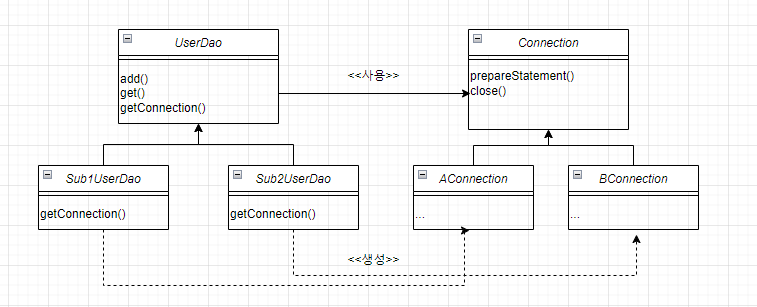
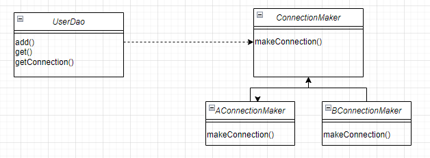

---

두 명의 개발자에게 동일한 기능 변경을 요청했다

한 명은 단 몇 줄의 코드만 수정하고 그 변경이 나머지 기능에는 전혀 문제를 일으키지 않는다는 것까지 검증해주는데 5분이 걸렸다.

그런데 다른 개발자는 동일한 기능을 변경하는데 5시간이 걸렸으며 그것이 다른 기능에 오류를 일으킬지도 모른다는 새로운 불안감을 일으켰다.


전자의 경우 미래의 변화에 대한 대비를 잘 한 경우이고 후자는 아니라고 볼 수 있다.


어떻게 변화에 잘 대비할 수 있었을까?

---

#### 관심사의 분리 (Separation of Concerns)

프로그래밍의 기초 개념이며 객체지향에 적용해서 보면 관심이 같은 것끼리는 하나의 객체 안으로 또는 친한 객체로 모이게 하고 <br/>
관심이 다른 것은 가능한 한 따로 떨어져서 서로 영향을 주지 않도록 분리하는 것이라고 생각할 수 있다.


코드를 통해 관심사의 분리를 이해해보자

UserDao라는 DB를 연결하고 DB와 데이터를 주고받는 클래스가 있다고 가정하겠다.

코드의 형태는 이러하다.


```java
public class UserDao{

    public void add(User user) throws ClassNotFoundException, SQLException{
        Class.forName("com.mysql.jdbc.Driver");
        
        Connection c = DriverManager.getConnection("jdbc:mysql://localhost/springbook","spring","book");

        PreparedStatement ps = c.prepareStatement("sql");
        ...
        
        ...
        
        ps.executeUpdate();

        ps.close();
        c.close();
    }

    public User get(String id) throws ClassNotFoundException, SQLException{
        ...
        Connection c = ...
        
        ...
        rs.close();
        ps.close();
        c.close();

        return user;
    }
}
 
```


UserDao 클래스의 관심사항
- DB와 연결을 위한 커넥션을 어떻게 가져올지에 대한 것
- 파라미터로 넘어온 사용자 정보를 Statement에 바인딩시키고 Statement에 담긴 SQL을 DB를 통해 실행키는 것
- 작업이 끝나면 사용한 리소스인 Statement와 Connection 오브젝트를 닫아줘서 공유 리소스를 시스템에 돌려주는 것

<br/>
첫번째 관심사인 DB연결을 위한 Connection 오브젝트를 가져오는 부분을 살펴보자
<br/>
다른 관심사의 코드와 섞여있으며 같은 코드가 다른 메소드에 중복되어 나타나고 있다는 문제를 확인할 수 있다.
<br/>
아직까지 두 개의 메소드밖에 없지만 앞으로 수백, 수천 개의 DAO 메소드를 만들게 될지 모르는데 같은 코드가 많은 곳에서 계속 중복되어 나타날 것이다.
<br/><br/>

바로 이렇게 하나의 관심사가 방만하게 중복되어 있고, 여기저기 흩어져 있어서 다른 관심의 대상과 얽혀 있다면
<br/>
변경이 일어날 때 엄청난 고통을 일으키는 원인이 된다. (스파게티 코드가 된다는 뜻)

<br/>
앞으로 이를 개선해 보도록 하겠다.

---
#### 템플릿 메소드 패턴 (Template Method Pattern)

상속을 통해 슈퍼클래스의 기능을 확장할 때 사용하는 가장 대표적인 방법이다.<br/>
변하지 않는 기능은 슈퍼클래스에 만들어두고 자주 변경되며 확장할 기능은 서브클래스에서 만들도록 한다.

#### 팩토리 메소드 패턴 (Factory Method Pattern)
서브 클래스에서 오브젝트 생성 방법과 클래스를 결정할 수 있도록 미리 정의해둔 메소드를 팩토리 메소드라고 하고 이 방식을 통해 <br/>
오브젝트 생성 방법을 슈퍼클래스의 기본 코드에서 독립시키는 방법을 팩토리 메소드 패턴이라고 한다.

<br/><br/>
템플릿 메소드 패턴을 이용해 DB커넥션을 만드는 코드를 분리해보겠다.

우선 UserDao를 추상 클래스로 만들고 DB커넥션 코드를 추상 메소드로 만들어서 서브클래스에서 이를 구현할 수 있도록 한다.

```java
public abstract class UserDao {
    
    public void add(User user) throws ClassNotFoundException, SQLException {
        Connection c = getConnection();
        ...
    }

    public User get(String id) throws ClassNotFoundException, SQLException {
        Connection c = getConnection();
        ...
    }

    public abstract Connection getConnection() throws ClassNotFoundException, SQLException;
}


public class Sub1UserDao extends UserDao {
    public Connection getConnection() throws ClassNotFoundException, SQLException {
        // Sub1UserDao의 DB Connection 생성코드
    }
}

public class Sub2UserDao extends UserDao {
    public Connection getConnection() throws ClassNotFoundException, SQLException {
        // Sub2UserDao의 DB Connection 생성코드
    }
}
```

이렇게 하면 UserDao는 어떻게 커넥션이 만들어지는지 관심이 없으며 어떤식으로 Connection이 구현되든<br/>
UserDao는 수정할 필요가 없다. UserDao는 DB Connection을 어떻게 가져올까라는 관심에서 독립적이게 됐다

이렇게 서브클래스에서 이런 메소드를 필요에 맞게 구현해서 사용하도록 하는 방법을 디자인 패턴에서 템플릿 메소드 패턴이라 하고

서브클래스에서 구체적인 오브젝트 생성 방법을 결정하게 하는 것을 팩토리 메소드 패턴이라고 한다.


<br/><br/>

템플릿 메소드 패턴을 통해 코드를 개선했지만 사실 이방법은 상속을 사용했다는 단점이 있다.<br/>
자바는 다중상속을 지원하지 않는다.<br/>
단지 커넥션 객체를 가져오는 방법을 분리하기 위해 상속구조로 만들어버리면 후에 다른 목적으로 UserDao에 상속을 적용하기 힘들고 또 <br/>
다른 문제는 상속을 통한 상하위 클래스의 관계는 생각보다 밀접하다는 점이다.
<br/><br/>
서브클래스는 슈퍼클래스의 기능을 직접 사용할 수 있다. 그래서 슈퍼클래스 내부의 변경이 있을 때 모든 서브클래스를 함께 수정하거나 다시 개발해야 할 수도 있다.<br/>
확장된 기능인 DB 커넥션을 생성하는 코드를 다른 DAO 클래스에 적용할 수 없다는 것도 큰 단점이다.<br/>
만약 UserDao 외의 DAO 클래스들이 계속 만들어진다면 그때는 상속을 통해서 만들어진 getConnection()의 구현 코드가 매 DAO 클래스마다 중복돼서 나타나는 심각한 문제가 발생할 것이다.

이를 해결할 수 있는 방법이 있다.<br>
클래스간 긴밀하게 연결되어 있지 않도록 중간에 추상적인 느슨한 연결고리를 만들어주는 것이다.<br/>
추상화란 어떤 것들의 공통적인 성격을 뽑아내어 이를 따로 분리해내는 작업이다. <br/>
자바가 추상화를 위해 제공하는 가장 유용한 도구는 바로 인터페이스다. <br/>
인터페이스는 자신을 구현한 클래스에 대한 구체적인 정보는 모두 감춰버린다.<br/>
<br/>
인터페이스를 도입해 이를 해결해보도록 하겠다.<br/>
아래는 인터페이스를 도입한 결과이다.



```java
public interface ConnectionMaker{
    public Connection makeConnection() throws ClassNotFoundException, SQLException;
}


public class UserDao {
    private ConnectionMkaer connectionMaker;

    public UserDao(){
        ConnectionMaker = new Sub1ConnectionMaker();
    }

    public void add ...{
        Connection c = connectionMaker.makeConnection();
        ...
    }

    public User get ...{
        Connection c = connectionMaker.makeConnection();
        ...
    }
    
}

```
<br/>
하지만 여기에도 문제가 있다 UserDao가 ConnectionMaker의 구현체인 구체적인 클래스를 알고있다는 것이다.<br/>
이때문에 인터페이스를 이용한 분리에도 불구하고 여전히 UserDao 변경 없이는 DB 커넥션 기능의 확장이 자유롭지 못하다.<br/>
UserDao는 UserDao가 사용할 ConnectionMaker의 특정 구현 클래스 사이의 관계를 설정해주는 것에 관한 관심사를 분리해야만 <br/>
독립적으로 확장 가능한 클래스가 될 수 있다.